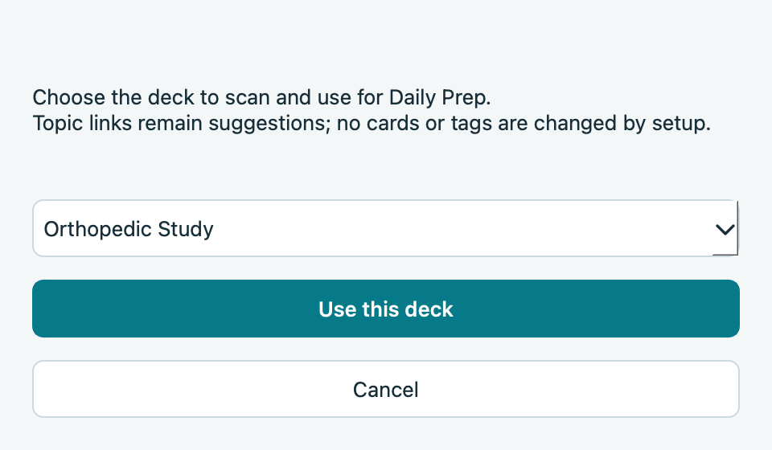
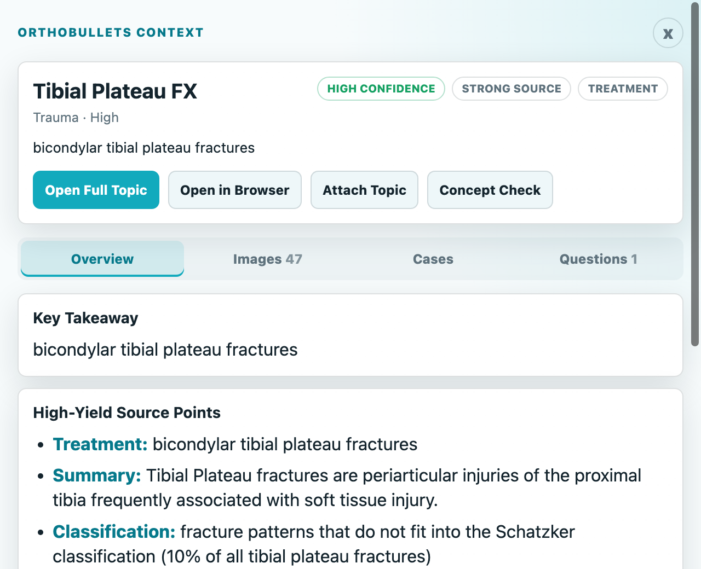
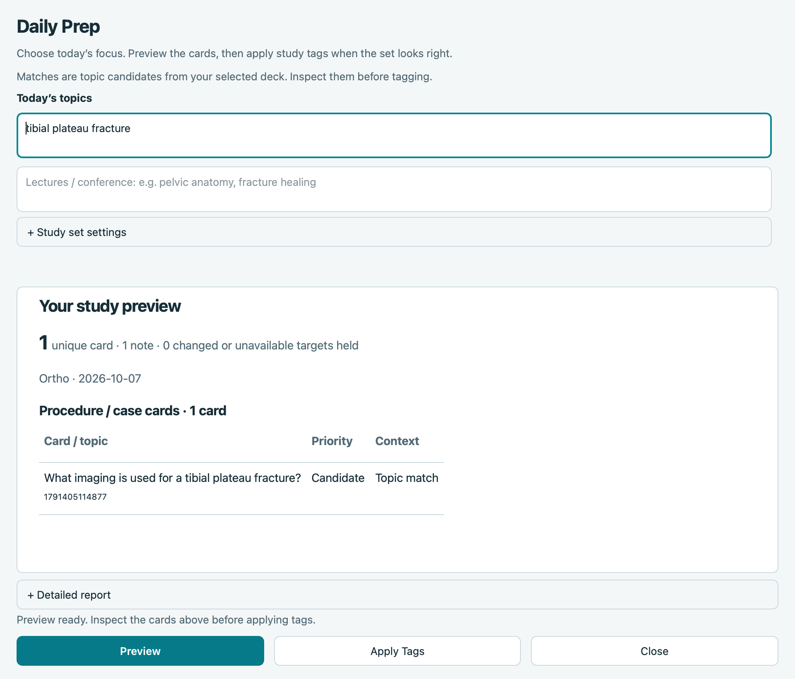

# Orthobullets Context Beta — Rahvan

Bring orthopedic source context into your Anki study sessions. Review a card,
open a suggested Orthobullets topic, or preview a set of cards for a lecture or case.

**[Install from AnkiWeb](https://ankiweb.net/shared/info/1699391455)** ·
**Add-on code: `1699391455`** · **[Report an issue](https://github.com/shadingtons/orthobullets-context/issues/new/choose)**

Version **0.1.0-beta.2**. Tested on **Anki 25.09.4 / macOS**. The current download
is restricted to that Anki version. Windows/Linux are not yet validated.
Add-ons run in desktop Anki, not AnkiWeb or mobile clients.

## Install and choose your deck

1. In desktop Anki, open **Tools → Add-ons → Get Add-ons**.
2. Enter **1699391455** and confirm the download.
3. Fully quit Anki, then reopen your study profile.
4. Choose **Orthobullets → Choose Study Deck**, select your orthopedic deck and
   click **Use this deck**. Repeat this selection for each profile you use.

Setup selects a study scope. It does not change your cards, tags or scheduling.
Selecting a parent deck includes its child decks under Anki's normal search behavior.

## Open source context while reviewing

Review a card, then use the **Orthobullets toolbar button** or
**Orthobullets → Open Context Panel**. Open the full topic to check the source;
use source-context Concept Checks when available.

Topic matches and context excerpts are suggestions. Confirm that a topic fits
your card; the add-on does not certify card answers or perform a complete clinical audit.

## Prepare for a lecture or case

1. Choose **Orthobullets → Daily Prep → Build Daily Prep Tag**.
2. Enter a case or lecture topic, such as **tibial plateau fracture**.
3. Click **Preview** and inspect the candidate cards.
4. Click **Apply Tags** only when the selection fits. Close without applying to
   leave note tags unchanged.

Screenshots show the published beta using disposable demo cards. Card IDs and
study results in the examples are illustrative; your deck determines your results.

## Decks and older editions

No deck is included or required from a particular author. You can use your own
orthopedic deck. The personal reviewed-card inventory, HY shortlist and card-ID
procedure presets are outside this public beta.

Installing the public edition disables older `orthobullets_context` and
`orthobullets_context_beta` copies to prevent duplicate menus. Their settings
and `user_files` remain in their original folders. Private data is not copied
across identities automatically. Choose your study deck again after installing
from AnkiWeb. Keep the personal edition if you need its card-specific tools.

We have not published a Rahvan-modified Marty deck. Its original source,
redistribution basis and clean import still need to be established before release.

## Troubleshooting and feedback

- **No Orthobullets menu:** fully quit and restart Anki; check that the add-on is
  enabled and your desktop version is 25.09.4.
- **No Daily Prep candidates:** confirm the selected deck contains matching
  cards, and try a more specific orthopedic topic. A parent deck includes children.
- **Wrong suggested topic:** inspect the full source; use **More → Wrong Topic**
  in the context panel. Feedback stays local; submit an issue separately if needed.
- **A tag operation stopped or has a pending journal:** preserve the journal,
  stop retrying that operation and report the error. Do not delete it to bypass
  the guard. An uncertain result needs inspection before further writes.
- **Source page/login fails:** the full topic can be opened in your browser.
  Live embedded Orthobullets login has not been validated for this beta.

Use the **Issues** tab to report bugs. Include Anki version, operating system,
add-on version, steps to reproduce, expected behavior and actual behavior.
Redact screenshots. Do not upload collections, private `user_files`, operation
journals, passwords or identifying information publicly.

After add-on updates, fully quit and restart Anki. Deck updates are separate.

## Data, source and credits

Setup, matching and previews do not change note fields or scheduling.
**Apply Tags** writes the previewed note tags. **Attach** is a separate, explicit
field/tag action. There is no automatic unsuspension or sync. Online searches
send extracted topic phrases to Orthobullets; embedded pages contact Orthobullets.
Caches, feedback and journals stay local. No telemetry or external AI service is used.

Software by **Rahvan**, licensed under **AGPL-3.0-or-later**. The AnkiWeb download
contains editable runtime source, the license and a `developer` folder with the
corresponding source archive, tests and reproducible build instructions.
This repository contains the setup guide, support templates and demo screenshots.
Orthobullets reference content retains its separate ownership and rights;
the software license does not relicense it. This is an independent add-on,
not an official Orthobullets, Anki or AMBOSS product.
